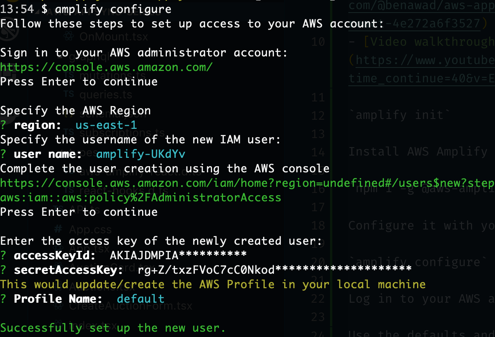
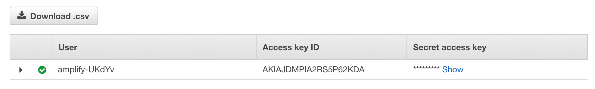
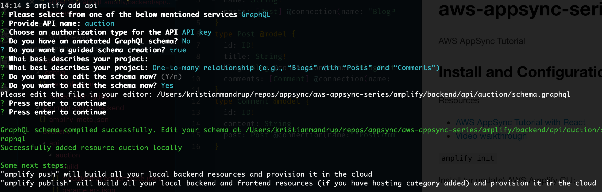
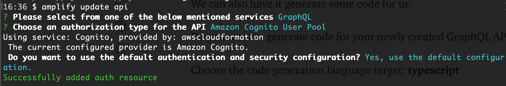
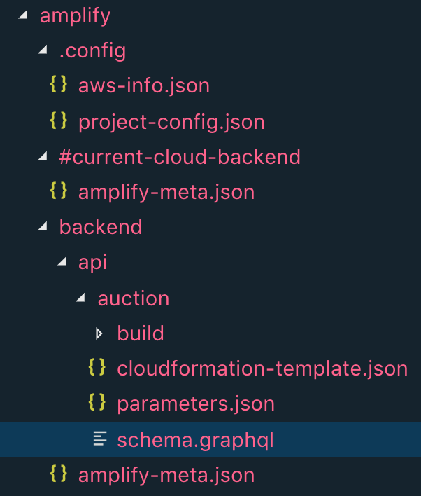
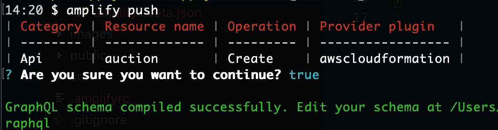

# aws-appsync-series

AWS AppSync Tutorial

## Install and Configuration

Resources

- [AWS AppSync Tutorial with React](https://medium.com/@benawad/aws-appsync-tutorial-with-react-4e272a6f3527)
- [Video walkthrough](https://www.youtube.com/watch?time_continue=40&v=E270S3eNqSg)

### Prepare/Configure AWS amplify

Install (or update) AWS Amplify CLI:

`npm i -g @aws-amplify/cli`

Configure your AWS amplify app:

`amplify configure`

This will open your browser to the AWS login screen. Now log in to your AWS account.

Click through the questions on the terminal and AWS console browser screen to create User IAM roles etc.



### Init amplify app

`amplify init`

## AWS User Credentials



Copy paste the access key ID to the console question:

- `accessKeyId`

Click show on `Secret access key` and copy paste the secret key to the console question:

`secretAccessKey`

These credentials will be stored in an environment variables file locally that is also in `.gitignore` so that it will not be part of the repo for security concerns.

## Amplify app

After amplify initialisation and configuration you should now have an `amplify` folder:

```txt
/amplify
    /.config
    /#current-cloud-backend
    /backend
.amplifyrc
```

### Add API



`amplify add api`

Make sure you choose `AWS Cognito user pools` for authentication.



### Amplify project



### Amplify push



`amplify push`

In case the push freezes, it is most likely due to a misconfiguration in one of the previous steps. Try this recipe again from the beginning.

Note: It might well be your best option to start with a clean AWS amplify project and then pull in the app from the remote repo on top of it.

## Git ignored files

Note that the following file patterns are added to `.gitignore` and not part of the repo:

```txt
amplify
.amplifyrc
aws-exports.js
.graphqlconfig.yml
```
